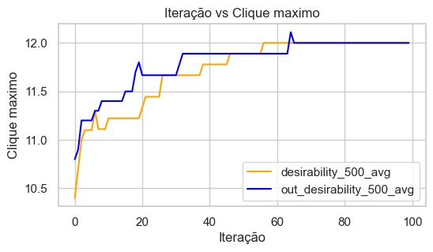
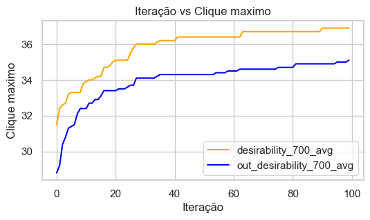

# Max Clique Problem with Ant Colony Optimization

### Overview
This repository provides an implementation of the Ant Colony Optimization (ACO) algorithm to solve the Max Clique Problem.

### Max Clique Problem

The Max Clique Problem is a well-known NP-hard problem in graph theory. The objective is to find the largest subset of vertices in a graph where all vertices are adjacent to each other, i.e., they form a clique.
Ant Colony Optimization (ACO)

Ant Colony Optimization is a metaheuristic optimization technique inspired by the behavior of real ants when finding short paths between their colonies and food sources. It's primarily known for its application in routing problems, like the Traveling Salesman Problem, but can be adapted to solve various combinatorial optimization problems.

### Results

